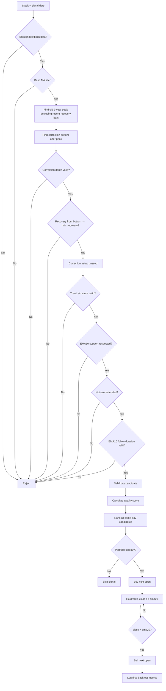
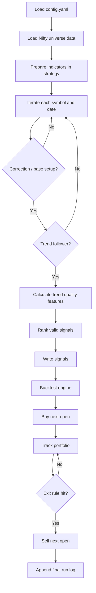
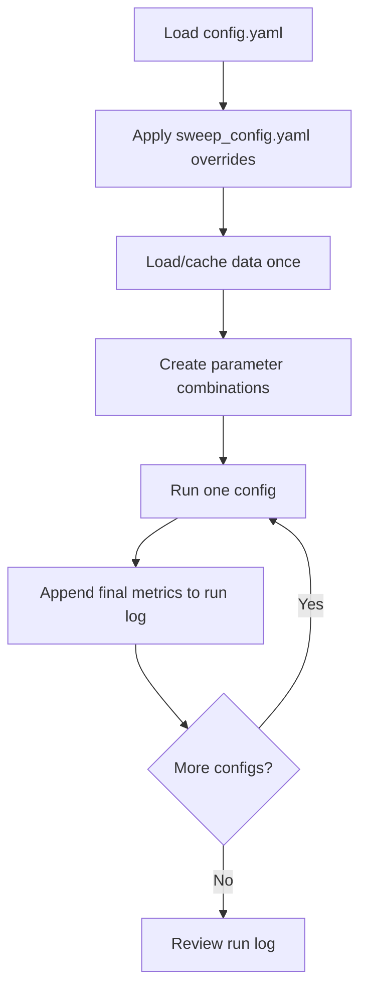

# Base Strategy Flow

## Strategy-Specific Flowchart



### Strategy Decision Blocks

```text
Base setup:
old peak -> correction bottom -> recovery from bottom
```

```text
Trend setup:
close > ema10
ema10 > ema21
ema21 rising
EMA10 touches enough
EMA10 breaches limited
```

```text
Entry quality:
close is above EMA10 but not stretched
z_ema10 is controlled
EMA10 follow days show trend is proven but not too late
```

```text
Ranking:
best valid setup gets priority
```

```text
Exit:
close below EMA20
```

## High-Level Flow



## 1. Data

Data loader should provide only OHLCV:

```text
open
high
low
close
volume
```

Strategy calculates indicators internally:

```text
dma20, dma50, dma200
ema10, ema20, ema21, ema50, ema200
atr14
swing_low_20
```

## 2. Base / Correction Setup

The stock must first pass the base condition:

```text
Enough lookback data
Base MA filter passes
Find old peak excluding latest recovery bars
Find correction bottom after that peak
Correction depth between min_depth and max_depth
Recovery from bottom >= min_recovery
```

Base MA filter:

```text
close > long MA
short MA > long MA
```

MA type is configurable:

```yaml
base_ma_type: ema
```

## 3. Trend Follower Filter

After base setup passes, trend follower must pass:

```text
close > ema10
ema10 > ema21
ema21 rising
ema10 touches >= min_touches
ema10 breaches <= max_breaches
ema10 extension between 0 and max_ema10_extension
ema10 z-score <= max_ema10_zscore
ema10 follow days between min and max follow days
efficiency >= min_efficiency_ratio
```

Touch logic:

```text
Count touch if:
low is within touch_tolerance of ema10
OR close is above ema10 but within touch_tolerance of ema10

Do not count touch on breach candles.
```

Breach logic:

```text
close < ema10 * (1 - breach_tolerance)
```

## 4. Trend Quality Features

Signals store these quality fields:

```text
ema_extension
ema21_extension
z_ema10
z_ema21
touches_ema10
breaches_ema10
ema10_follow_days
ema10_follow_violations
efficiency_20
slope_ema10
slope_ema21
```

## 5. Ranking

Only valid signals are ranked.

Ranking prefers:

```text
closer above ema10
lower ema10 z-score
higher efficiency
ema10 follow days closer to ideal
fewer breaches
more touches
```

Current score:

```text
score =
  - ema10_extension * 100
  - z_ema10
  + efficiency_20 * 2
  - abs(ema10_follow_days - ideal_ema10_follow_days) * 0.10
  - breaches_ema10 * 0.50
  + touches_ema10 * 0.20
```

Higher score ranks better.

## 6. Buy Logic

Backtest reads ranked signals by date.

Current buy behavior:

```text
Buy signal stocks on next available open
Position size = position_size_pct of current portfolio equity
Do not buy same stock again if already open
Respect min_reentry_gap_days after prior entry
Skip if cash is insufficient
```

## 7. Exit Logic

Current exit rule:

```text
Sell when close < ema20
```

Execution:

```text
Signal generated on close
Sell order executes on next available open
```

## 8. Output And Logs

Final run log:

```text
results/base_strategy_run_log.csv
```

The log stores:

```text
run metadata
date range
all config params
return metrics
trade metrics
drawdown metrics
holding metrics
exposure metrics
```

Optional output files are controlled from config:

```yaml
output_files:
  trades_csv: false
  tradebook_csv: false
  positions_csv: false
  closed_positions_csv: false
  equity_curve_csv: false
  equity_curve_png: false
```

## 9. Sweep Flow


